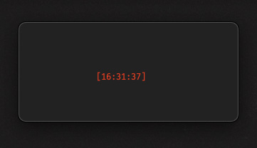

### Terminal clock

- Simple clock to display as a widget in your terminal.
- Screenshot is from iTerm2 with configs bellow.
- [iTerm2](https://iterm2.com/) 
  - https://github.com/wintermute-84/iterm-conf

